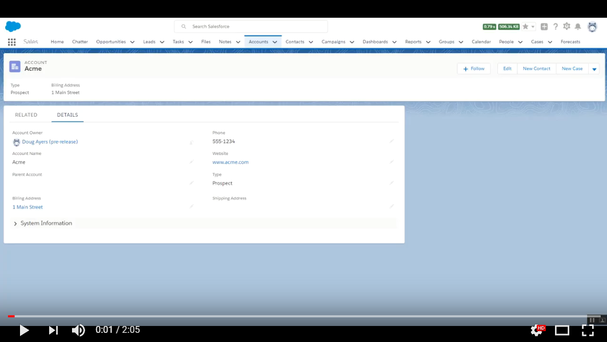
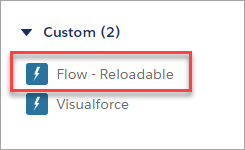
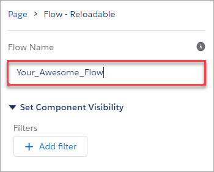

Reloadable Flow Lightning Component
===================================

Overview
--------

Demo embedding Flow (via Lightning Component) in Lightning Record Page and it reloading when the record is updated.

This project is a new take on my earlier project [Reloadable Visualforce Lightning Component](https://github.com/DouglasCAyers/sfdc-reloadable-visualforce-lightning-component),
whose purpose was to provide a way to display a Flow on a Lightning Record Page and have that Flow dynamically sync itself
with any data changes made on the page.

That first project cobbled together a myriad of concepts, and although functional, it still didn't render the Flow in Lightning Runtime.

With [Winter '18](https://releasenotes.docs.salesforce.com/en-us/winter18/release-notes/rn_forcecom_flow_component.htm)
we now have the [<lightning:flow>](https://developer.salesforce.com/docs/atlas.en-us.210.0.lightning.meta/lightning/aura_compref_lightning_flow.htm) component.
We no longer need an `<iframe>` or Visualforce page to embed our Flow.

Demo Video
----------

Installation
------------

You may install the unmanaged code from GitHub and make any desired adjustments.

* [Deploy from Github](https://githubsfdeploy.herokuapp.com)

This will add a Lightning Component named `ReloadableFlowCmp` to your org (label in App Builder is **Flow - Reloadable**).

Getting Started
---------------

1. Install this unmanaged package to your org using link above.
2. Edit (or create new) a **Lightning Record Page** for an object (e.g. Account).
3. Ensure the **Standard** component named **Record Detail** is on your Lightning Page.
4. Drag the **Custom** component named **Flow - Reloadable** onto your Lightning Page.

5. Configure the **Custom** component by specifying **Flow Name** (e.g. `Your_Awesome_Flow`).

6. **Save** and **Activate** your Lightning Record Page.
7. Navigate to a record page to test.
9. Edit and save the record and notice your Flow refreshes too!
10. Click the Finish button on your Flow and notice the rest of the page refreshes too!
